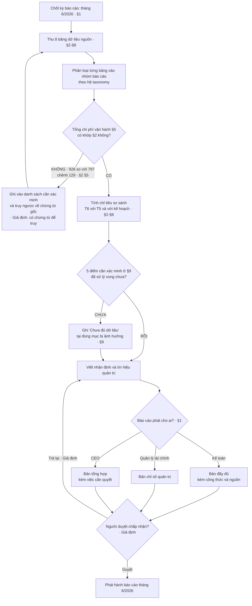
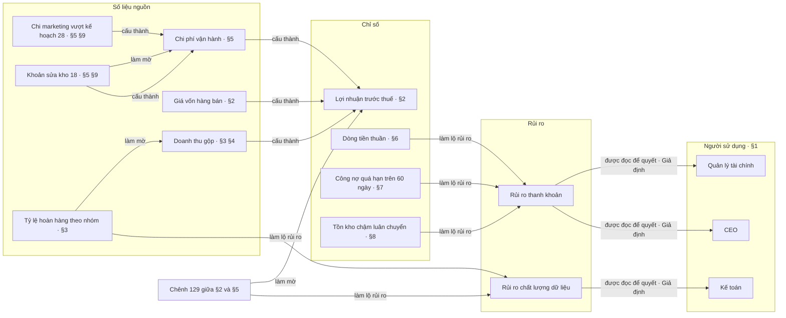

# Bài tập 4 — Flowchart và Concept Map

**Nguồn dữ liệu:** `bai-04-sample-01.md` (Công ty Minh An Retail, tháng 6/2026)
**Chạy trên:** Claude Opus 5 trong Claude Code — 04/09/2026

---

## 1. Câu lệnh em tự viết (một câu lệnh, hai sơ đồ)

Đề bài có một cái bẫy: **`sample-01` không hề mô tả quy trình lập báo cáo.** Nó chỉ có 8 bảng số và
một danh sách điểm cần xác minh. (Quy trình được viết ra nằm ở `sample-02` §11, không phải file này.)
Nghĩa là mọi bước trong flowchart hoặc phải **suy từ chính dữ liệu**, hoặc phải **gắn nhãn `Giả định`**
— và đó là lý do câu lệnh dưới đây dành hẳn một khối cho chuyện gắn nhãn.

```text
### ROLE
Bạn là kiến trúc sư thông tin. Bạn vẽ sơ đồ để người khác kiểm tra được lập luận, không phải để
trang trí tài liệu.

### TASK
Đọc tệp bai-04-sample-01.md và tạo HAI sơ đồ Mermaid trong cùng một lần trả lời.

SƠ ĐỒ 1 — flowchart quy trình lập, kiểm tra và phê duyệt báo cáo tháng.
SƠ ĐỒ 2 — concept map nối nguồn dữ liệu, chỉ số, rủi ro và người sử dụng.

### CONTEXT — hai sơ đồ phải trả lời hai câu hỏi KHÁC NHAU
Sơ đồ 1 trả lời: "Bước tiếp theo phải làm gì, và trong điều kiện nào?"  → có thứ tự, có thời gian.
Sơ đồ 2 trả lời: "Các khái niệm liên hệ với nhau theo kiểu gì?"        → không có thứ tự, không có
                                                                          thời gian.
Nếu một khái niệm xuất hiện ở cả hai sơ đồ, nó phải đóng hai vai khác nhau. Nếu bạn thấy sơ đồ 2
đang kể lại các bước theo thứ tự, tức là bạn đã vẽ trùng — vẽ lại.

### RÀNG BUỘC SƠ ĐỒ 1
- Tối thiểu HAI điểm rẽ nhánh theo điều kiện (nút quyết định có hai đường ra).
- Tối thiểu MỘT nhánh quay ngược về một bước đã đi qua.
- Ít nhất một điểm rẽ nhánh phải bắt nguồn từ một mâu thuẫn số liệu CÓ THẬT trong tệp, và nhãn
  của nhánh đó phải ghi hai con số đang chọi nhau.

### RÀNG BUỘC SƠ ĐỒ 2
- Từ 10 đến 16 khái niệm hoặc thực thể.
- Ít nhất BA loại quan hệ, mỗi loại phải được GỌI TÊN trên cạnh nối. Không dùng mũi tên trống.
- Không được có khái niệm nào đứng lẻ, không nối với gì.

### RÀNG BUỘC CHUNG — quan trọng nhất
Tệp bai-04-sample-01.md KHÔNG mô tả quy trình lập báo cáo. Vậy nên:
- Bước hoặc quan hệ nào rút được từ số liệu / chú thích trong tệp thì ghi mục nguồn (§2, §5, §9...).
- Bước hoặc quan hệ nào bạn suy ra từ thông lệ chung mà tệp không nói thì BẮT BUỘC gắn chữ
  "Giả định" ngay trên nhãn của nút hoặc cạnh đó.
- Không được im lặng bịa thêm một bước cho sơ đồ trông đầy đủ.

### OUTPUT
Sơ đồ 1 → sơ đồ 2 → bảng liệt kê mọi mục có gắn "Giả định" → đúng HAI ý nói rõ sự khác nhau
giữa hai sơ đồ.

### EVALUATION (tự kiểm trước khi trả lời)
1. Đếm lại: sơ đồ 1 có mấy nút quyết định, mấy nhánh quay lại? Sơ đồ 2 có mấy khái niệm,
   mấy loại quan hệ?
2. Che sơ đồ 1 đi và đọc riêng sơ đồ 2: nó có còn kể chuyện theo thứ tự thời gian không?
   Nếu có là đã vẽ trùng.
3. Có nút hay cạnh nào không có mục nguồn mà cũng không có chữ "Giả định" không?
```

---

## 2. Kết quả AI tạo ra

### Sơ đồ 1 — Flowchart: lập, kiểm tra và phê duyệt báo cáo tháng



**Đếm:** 4 nút quyết định (D, G, J, L) · **2 nhánh quay lại** (E → B và L → I).
Yêu cầu tối thiểu là 2 nút quyết định và 1 nhánh quay lại.

Nhánh rẽ ở nút **D** bắt nguồn từ mâu thuẫn có thật: §5 ghi tổng chi phí vận hành tháng 6 là **926**,
trong khi §2 cho **455 + 342 = 797**, dù chú thích §5 nói hai con số này cùng phạm vi. Chênh **129**.

### Sơ đồ 2 — Concept map: dữ liệu, chỉ số, rủi ro, người dùng



**Đếm:** 16 khái niệm (6 nguồn · 4 chỉ số · 1 điểm chênh · 2 rủi ro · 3 người dùng) — đúng cận trên
của dải 10–16. **4 loại quan hệ được gọi tên:** `cấu thành` · `làm lộ rủi ro` · `làm mờ` ·
`được đọc để quyết`. Không có khái niệm nào đứng lẻ.

Ba khái niệm mang **hai loại quan hệ cùng lúc** — đây là chỗ concept map cho thấy thứ mà flowchart
không cho thấy: `SK` (khoản sửa kho) vừa *cấu thành* chi phí vừa *làm mờ* chính chi phí đó; `HH`
(hoàn hàng) vừa *làm mờ* doanh thu vừa *làm lộ* rủi ro dữ liệu; `CHENH` vừa *làm mờ* lợi nhuận vừa
*làm lộ* rủi ro dữ liệu.

### Mọi mục gắn "Giả định"

| Sơ đồ | Mục | Vì sao là giả định |
|---|---|---|
| 1 | Nút E — "truy ngược về chứng từ gốc" | Tệp không nói có chứng từ gốc để truy, cũng không nói ai giữ |
| 1 | Nút L — "Người duyệt chấp nhận?" | Tệp **không nêu người phê duyệt nào**. §1 chỉ nói ba người *đọc* báo cáo, không nói ai *duyệt* |
| 1 | Nhánh L → I — "Trả lại" | Kéo theo giả định trên: đã giả định có người duyệt thì mới có đường trả lại |
| 2 | Ba cạnh `được đọc để quyết` | §1 nói báo cáo dành cho kế toán, quản lý tài chính và CEO, nhưng **không nói ai đọc rủi ro nào**. Việc gán rủi ro thanh khoản cho CEO và rủi ro dữ liệu cho kế toán là suy từ vai trò, tệp không đỡ |

Ba bước còn lại của flowchart (A, B, F) và toàn bộ quan hệ `cấu thành` / `làm lộ rủi ro` / `làm mờ`
đều rút thẳng từ số liệu và chú thích trong tệp, nên có mục nguồn thay vì nhãn giả định.

### Hai ý về sự khác nhau giữa hai sơ đồ

**Ý 1 — Cùng một sự kiện, hai vai khác nhau.** Chênh lệch 129 giữa §2 và §5 xuất hiện ở cả hai sơ
đồ. Ở flowchart nó là **một cái cổng**: chưa gỡ xong thì quy trình quay ngược về bước thu dữ liệu,
không đi tiếp được. Ở concept map nó là **một nút có hai cạnh toả ra**: nó làm mờ lợi nhuận trước
thuế, đồng thời làm lộ rủi ro chất lượng dữ liệu. Flowchart nói *nó chặn việc gì*; concept map nói
*nó dính tới cái gì*. Bỏ flowchart thì không biết phải dừng lại; bỏ concept map thì không biết dừng
lại rồi thì những con số nào đang bị treo theo.

**Ý 2 — Một cái có thời gian, một cái không.** Flowchart chỉ đọc được theo một chiều, từ chốt kỳ tới
phát hành, và mọi mũi tên đều mang nghĩa "xong bước này rồi mới tới bước kia". Concept map không có
điểm bắt đầu: đọc từ `CEO` ngược về `Chi marketing` cũng hợp lệ như đọc xuôi, vì mũi tên của nó mang
nghĩa quan hệ chứ không mang nghĩa thứ tự. Đó cũng là lý do concept map **cấm** dùng mũi tên trống —
mũi tên không tên trong một đồ thị không có thời gian thì người đọc không biết nên hiểu là "gây ra",
"thuộc về" hay "được tính từ".

---

## 3. Tự đánh giá

1. **Đạt đủ các ngưỡng đề ra.** Flowchart: 4 nút quyết định và 2 nhánh quay lại (yêu cầu 2 và 1).
   Concept map: 16 khái niệm (dải 10–16) và 4 loại quan hệ có tên (yêu cầu 3). Hai sơ đồ không trùng
   chức năng — kiểm bằng cách che flowchart rồi đọc riêng concept map, nó không kể được thứ tự nào.

2. **Phần đáng giá nhất là khối "RÀNG BUỘC CHUNG" về nhãn `Giả định`.** Nếu không có nó, flowchart
   chắc chắn sẽ mọc ra một chuỗi bước nghe rất hợp lý — "tổ chuyên môn rà soát", "ban giám hiệu phê
   duyệt" kiểu quy trình mẫu — mà `sample-01` không hề có. Bắt tách rạch ròi *rút từ tệp* với *suy
   từ thông lệ* làm lộ ra một sự thật khó chịu: **4 trong số các mục của hai sơ đồ là giả định**, và
   toàn bộ khâu phê duyệt của flowchart đứng trên không khí. Đó là thông tin có ích cho người đọc,
   không phải khuyết điểm cần giấu.

3. **Chỗ còn yếu: khâu phê duyệt bị treo mà em vẫn vẽ.** Cách sạch hơn là **không vẽ nút L**, chỉ
   ghi một dòng "quy trình phê duyệt: chưa đủ dữ liệu". Em vẫn vẽ vì đề bài đòi flowchart phải có
   *"lập, kiểm tra và phê duyệt"*, bỏ hẳn thì thiếu yêu cầu. Đây là chỗ yêu cầu của đề va vào giới
   hạn của dữ liệu, và em chọn giữ nút nhưng gắn nhãn thay vì bỏ — đánh đổi có ý thức, không phải
   sơ suất.

4. **Chỗ còn thiếu: câu lệnh chưa ràng buộc kích cỡ sơ đồ.** Concept map ra đúng 16 khái niệm, tức
   là chạm trần. Nếu tệp dữ liệu lớn hơn một chút thì AI sẽ phải tự cắt, mà câu lệnh không nói cắt
   theo tiêu chí nào. Sửa: thêm dòng *"nếu vượt 16 khái niệm, giữ lại những khái niệm có từ hai
   quan hệ trở lên, bỏ khái niệm chỉ có một quan hệ"* — cho AI một luật cắt thay vì để nó tự chọn.

5. **Một chỗ suýt vẽ sai chức năng.** Bản chạy đầu, concept map có cạnh `Doanh thu gộp → Lợi nhuận
   trước thuế` gắn nhãn "dẫn tới", nghe như quan hệ nhân quả. Sửa thành `cấu thành` vì đó là quan hệ
   **số học** — doanh thu là một số hạng trong phép tính ra lợi nhuận, không phải nguyên nhân gây ra
   lợi nhuận. Đặt tên quan hệ cho đúng là phần khó nhất của concept map, và cũng là chỗ dễ lọt suy
   diễn nhân quả nhất.
