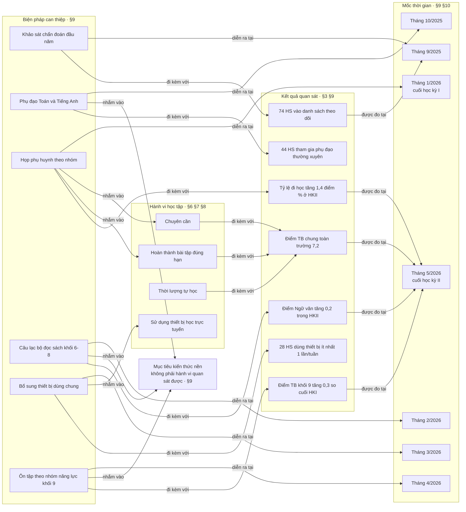
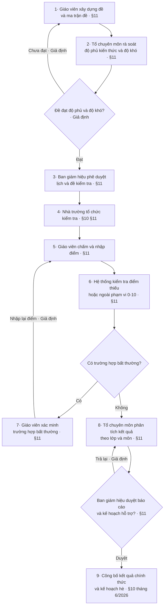

# Báo cáo kết quả học tập năm học 2025–2026
### Trường THCS Hoà Bình — trình Ban giám hiệu

**Nguồn dữ liệu duy nhất:** `bai-04-sample-02.md`. Mọi con số trong báo cáo đều ghi mục nguồn dạng
`[§n]` để truy ngược. Số nào được tính ra thì ghi kèm phép tính.
**Quy ước ngôn ngữ:** báo cáo chỉ dùng "có liên hệ với", "đi kèm với", "chênh lệch quan sát".
Dữ liệu hiện có **không đủ để kết luận nguyên nhân** — mục 12 của tệp nguồn nêu rõ điều này.

---

## 1. Tóm tắt điều hành

1. **Toàn trường tiến bộ đều.** Điểm trung bình chung cuối năm **7,2**, tăng **+0,6** so với đầu
   năm (6,6) `[§3]`. Cả bốn môn đều tăng, không môn nào đi lùi ở bất kỳ mốc đo nào `[§3]`.

2. **Ba phần tư học sinh đạt Khá trở lên.** 70 em mức Tốt và 166 em mức Khá trên 320, tức
   **73,8%** (236 ÷ 320) `[§4]`. Nhóm cần hỗ trợ — điểm trung bình chung dưới 5,0 — là **16 em,
   chiếm 5,0%** `[§4]`, khớp với tổng cột "Số HS cần hỗ trợ" của bảng chuyên cần `[§6]`.

3. **Tiếng Anh là môn phải ưu tiên.** Điểm thấp nhất trong bốn môn (**6,9** so với 7,3 của Toán và
   Ngữ văn) `[§2]`, và có **30 em dưới 5,0** — nhiều nhất, gấp 2,5 lần Ngữ văn (12 em) `[§5]`.

4. **Lớp 8B là điểm nóng đơn lẻ rõ nhất.** Điểm trung bình thấp nhất trường (6,6) `[§2]`, chuyên
   cần thấp nhất (91,8%) và số lượt nghỉ không phép nhiều nhất (**34 trên tổng 119** của cả trường)
   `[§6]`, đồng thời là lớp có tỷ lệ dưới 5,0 cao nhất ở **ba trong bốn môn** `[§5]`. Lớp này giữ
   **5 trong 16** em cần hỗ trợ của toàn trường `[§6]`, dù chỉ chiếm 12,5% sĩ số (40 ÷ 320).

5. **Hai yếu tố đi kèm chênh lệch điểm lớn nhất đều là hành vi nhà trường quan sát được hằng tuần:**
   hoàn thành bài tập đúng hạn từ 90% (**+1,2 điểm**) và đi học từ 95% số buổi (**+1,0 điểm**)
   `[§8]`. Đây là tin tốt về mặt điều hành — hai đòn bẩy này nằm trong tầm với của trường, không
   phải yếu tố ngoài kiểm soát.

6. **Một cảnh báo về cách đọc số.** Bảng yếu tố hỗ trợ **chưa kiểm soát khác biệt năng lực đầu
   năm** `[§12]`. Riêng nhóm phụ đạo là học sinh vốn đã dưới 5,0 từ đầu năm `[§9]`, nên con số
   +0,5 của nhóm này **không đọc được** như mức hiệu quả của chương trình phụ đạo. Xem mục 7.

7. **Việc cần ưu tiên ngay:** Tiếng Anh tại lớp 8B — 20,0% sĩ số lớp dưới 5,0, tức 8 trên 40 em,
   là ô nặng nhất trong toàn bộ dữ liệu `[§5]` — và nhóm **58 em tự học dưới 3 giờ/tuần**, nhóm duy
   nhất có điểm Tiếng Anh (5,8) tiệm cận ngưỡng cần hỗ trợ `[§7]`.

---

## 2. Các yếu tố có liên hệ với kết quả

### 2.1. Phân loại các yếu tố

Dữ liệu cho ba nhóm yếu tố khác nhau về mức nhà trường can thiệp được:

| Nhóm | Yếu tố | Nguồn | Nhà trường tác động được không |
|---|---|---|---|
| **A. Hành vi học tập** | Hoàn thành bài tập đúng hạn · Chuyên cần · Thời lượng tự học | `[§6] [§7] [§8]` | Quan sát và tác động hằng tuần |
| **B. Điều kiện hỗ trợ** | Chương trình phụ đạo · Thiết bị học trực tuyến · Phụ huynh tham gia trao đổi | `[§8] [§9]` | Tác động được theo đợt, tốn nguồn lực |
| **C. Bối cảnh lớp** | Chênh lệch giữa lớp A và lớp B trong cùng khối | `[§2]` | Chưa đủ dữ liệu để nói gì |

### 2.2. Chênh lệch quan sát theo từng yếu tố

Xếp theo mức chênh, từ lớn tới nhỏ `[§8]`:

| Yếu tố | Nhóm có | Số HS | Điểm TB | Điểm TB nhóm đối chiếu | Chênh lệch quan sát | Số HS ngoài nhóm |
|---|---|---:|---:|---:|---:|---:|
| Hoàn thành bài tập đúng hạn từ 90% | Có | 214 | 7,6 | 6,4 | **+1,2** | 106 |
| Đi học từ 95% số buổi | Có | 222 | 7,5 | 6,5 | **+1,0** | 98 |
| Có thiết bị học trực tuyến ổn định | Có | 286 | 7,3 | 6,5 | +0,8 | 34 |
| Phụ huynh tham gia ít nhất một buổi/học kỳ | Có | 238 | 7,4 | 6,6 | +0,8 | 82 |
| Tham gia phụ đạo ít nhất 80% số buổi | Có | 44 | 6,8 | 6,3 | +0,5 | — |

*Cột cuối tính bằng `320 − số HS trong nhóm`. Riêng dòng phụ đạo không tính được vì nhóm đối chiếu
là "tham gia dưới 80% **hoặc** không tham gia", không phải toàn bộ phần còn lại của trường.*

**Thời lượng tự học** `[§7]` cho quan hệ đều nhất trong toàn bộ dữ liệu — điểm tăng liên tục qua cả
bốn bậc, không có bậc nào đi ngược:

| Tự học/tuần | Số HS | Điểm TB chung | Toán | Tiếng Anh |
|---|---:|---:|---:|---:|
| Dưới 3 giờ | 58 | 6,2 | 6,1 | **5,8** |
| 3 – dưới 5 giờ | 104 | 6,9 | 6,9 | 6,5 |
| 5 – dưới 7 giờ | 106 | 7,5 | 7,6 | 7,2 |
| Từ 7 giờ | 52 | 8,0 | 8,1 | 7,8 |

Khoảng cách giữa bậc cao nhất và bậc thấp nhất: **2,0 điểm ở Toán** (8,1 − 6,1) và **2,0 điểm ở
Tiếng Anh** (7,8 − 5,8), rộng hơn khoảng cách của điểm trung bình chung (1,8). *Lưu ý: dữ liệu tự
học lấy từ khảo sát tự báo cáo, có thể sai lệch ghi nhớ `[§12]`.*

### 2.3. Phân tích theo từng môn

**Toán** — Điểm cuối năm **7,3**, tăng **+0,7** từ 6,6 đầu năm, mức tăng cao nhất cùng Tiếng Anh
`[§3]`. Có **20 em dưới 5,0** (6,3%), tập trung nhất tại 8B với 15,0% sĩ số lớp, tức 6 em
(15,0% × 40) `[§5]`. Toán nằm trong chương trình phụ đạo từ tháng 10/2025 `[§9]`. Lớp cao nhất 9A
(8,0), thấp nhất 8B (6,5) `[§2]`. Trong bảng tự học, Toán là môn có khoảng cách giữa các bậc rộng
nhất — 6,1 ở nhóm dưới 3 giờ so với 8,1 ở nhóm từ 7 giờ `[§7]`.

**Ngữ văn** — Điểm cuối năm **7,3**, nhưng **tăng ít nhất trong bốn môn: +0,4** `[§3]`. Đây cũng là
môn có ít em dưới 5,0 nhất: **12 em (3,8%)** `[§5]`. Mức tăng thấp đi kèm với xuất phát điểm cao —
đầu năm Ngữ văn đã là **6,9, cao nhất trong bốn môn** `[§3]` — nên không đọc được như dấu hiệu trì
trệ. Câu lạc bộ đọc sách khối 6–8 chạy từ tháng 2/2026; tệp ghi kết quả quan sát là điểm Ngữ văn
tăng 0,2 từ cuối học kỳ I đến cuối học kỳ II `[§9]`, khớp đúng với dãy 7,1 → 7,3 của `[§3]`. Lớp
thấp nhất là 8B (6,9) — vẫn là mức cao nhất trong bốn môn của chính lớp đó `[§2]`.

**Tiếng Anh** — **Môn yếu nhất trên mọi chỉ số.** Điểm cuối năm 6,9, thấp hơn môn dẫn đầu 0,4 điểm
`[§2]`. Điểm đầu năm cũng thấp nhất (6,2) và tăng +0,7 ngang Toán `[§3]` — nghĩa là môn này tiến bộ
không kém, nhưng xuất phát thấp nên vẫn đứng cuối. **30 em dưới 5,0 (9,4%)**, nhiều nhất trong bốn
môn `[§5]`. Tại 8B tỷ lệ là **20,0%**, tức **8 trên 40 em** — ô đơn lẻ nặng nhất trong toàn bộ dữ
liệu `[§5]`. Ở nhóm tự học dưới 3 giờ/tuần, điểm Tiếng Anh là **5,8**, chỉ cách ngưỡng cần hỗ trợ
0,8 điểm `[§7]`. Tiếng Anh cùng Toán nằm trong chương trình phụ đạo tháng 10/2025 `[§9]`.

**Khoa học tự nhiên** — Điểm cuối năm **7,2**, tăng +0,5 `[§3]`. Có **18 em dưới 5,0 (5,6%)**
`[§5]`. Khác ba môn trên ở một điểm đáng chú ý: lớp có tỷ lệ dưới 5,0 cao nhất **không phải 8B mà
là 7B (12,5%, tức 5 em)** `[§5]` — đây là môn duy nhất mà điểm nóng nằm ngoài 8B. Khoa học tự nhiên
**không nằm trong chương trình phụ đạo** — mục 9 chỉ nêu Toán và Tiếng Anh `[§9]`.

### 2.4. Hai quan sát cắt ngang các môn

**Mọi lớp B đều thấp hơn lớp A cùng khối**, chênh từ 0,5 đến 0,9 điểm: 6A 7,3 / 6B 6,8 (0,5) ·
7A 7,5 / 7B 6,9 (0,6) · 8A 7,5 / 8B 6,6 (0,9) · 9A 7,8 / 9B 7,0 (0,8) `[§2]`. Mẫu hình này lặp
lại ở cả bốn khối. Tệp **không mô tả cách xếp lớp**, nên không kết luận được gì thêm — xem mục 7.

**Quan hệ giữa chuyên cần và số em cần hỗ trợ không đều.** Lớp 9B có chuyên cần 94,1% — thấp thứ ba
từ dưới lên — nhưng chỉ có **1 em** cần hỗ trợ, bằng các lớp A. Trong khi 6B (94,5%) và 7B (93,9%)
mỗi lớp có 3 em `[§6]`. Nghĩa là chuyên cần thấp **đi kèm với** kết quả thấp ở phần lớn các lớp,
nhưng 9B là một ngoại lệ mà dữ liệu hiện có không giải thích được.

---

## 3. Bản đồ khái niệm theo thời gian

**Bốn loại quan hệ được gọi tên:** `diễn ra tại` · `nhắm vào` · `đi kèm với` · `được đo tại`.
Không quan hệ nào mang nghĩa nhân quả — đây là chủ ý, vì dữ liệu không đỡ được kết luận nhân quả.

**Hai điều bản đồ này cho thấy mà bảng số không cho thấy:**

- **Nhánh can thiệp và nhánh hành vi gần như rời nhau.** Chỉ **2 trong 6** can thiệp nhắm thẳng vào
  một hành vi học tập (họp phụ huynh → chuyên cần và bài tập; bổ sung thiết bị → sử dụng thiết bị).
  Ba can thiệp còn lại nhắm vào kiến thức nền, một là hoạt động chẩn đoán `[§9]`.
- **Thời lượng tự học (H3) không có can thiệp nào chĩa vào nó**, dù đây là yếu tố cho quan hệ đều
  nhất trong toàn bộ dữ liệu — chênh 1,8 điểm giữa bậc thấp nhất và cao nhất `[§7]`. Đó là một
  khoảng trống trong thiết kế can thiệp năm học vừa qua, không phải một kết luận về tác dụng.

---

## 4. Sơ đồ quy trình kiểm tra, đánh giá

**Ba điểm rẽ nhánh theo điều kiện** (D1, D2, D3) và **hai nhánh quay lại bước trước**
(D1 → bước 1, bước 7 → bước 5), cộng một nhánh trả lại ở khâu phê duyệt (D3 → bước 8).

**Những chỗ gắn `Giả định` và vì sao:**

| Mục | Vì sao là giả định |
|---|---|
| Nút D1 và nhánh "Chưa đạt" | `[§11]` có bước "Tổ chuyên môn rà soát độ phủ kiến thức và độ khó" nhưng **không nói chuyện gì xảy ra nếu đề không đạt**. Một bước rà soát mà không có đường trả lại thì không phải rà soát — nên vẽ, và gắn nhãn. |
| Nhánh bước 7 → bước 5 | `[§11]` có cả bước 6 (hệ thống phát hiện) lẫn bước 7 (giáo viên xác minh), nên **điểm rẽ nhánh D2 là có căn cứ**. Nhưng tệp không nói sau khi xác minh xong thì điểm được nhập lại ở đâu. |
| Nhánh "Trả lại" ở D3 | `[§11]` bước 9 là "Ban giám hiệu phê duyệt báo cáo và kế hoạch hỗ trợ". Có phê duyệt thì phải có khả năng không phê duyệt, nhưng tệp không mô tả đường đó. |

Bảy bước còn lại và điểm rẽ nhánh D2 lấy thẳng từ `[§11]`, mốc công bố lấy từ `[§10]`.

---

## 5. Bảng tổng kết thành tích

### 5.1. Toàn trường theo môn

| Môn | Đầu năm `[§3]` | Cuối HKII `[§2] [§3]` | Thay đổi cả năm `[§3]` | HS dưới 5,0 `[§5]` | Tỷ lệ `[§5]` | Lớp có tỷ lệ cao nhất `[§5]` |
|---|---:|---:|---:|---:|---:|---|
| Toán | 6,6 | 7,3 | +0,7 | 20 | 6,3% | 8B — 15,0% |
| Ngữ văn | 6,9 | **7,3** | **+0,4** | **12** | **3,8%** | 8B — 10,0% |
| Tiếng Anh | **6,2** | **6,9** | +0,7 | **30** | **9,4%** | **8B — 20,0%** |
| Khoa học tự nhiên | 6,7 | 7,2 | +0,5 | 18 | 5,6% | **7B — 12,5%** |
| **Trung bình chung** | **6,6** | **7,2** | **+0,6** | — | — | — |

> ⚠ **Không cộng cột "HS dưới 5,0".** Một em có thể cần hỗ trợ ở nhiều môn, nên 20 + 12 + 30 + 18
> **không phải** số học sinh cần hỗ trợ của trường `[§5] [§12]`. Số học sinh duy nhất là **16**,
> lấy từ `[§4]` và dòng tổng của `[§6]`.

### 5.2. Phân bố thành tích cuối năm `[§4]`

| Mức | Tiêu chí điểm TB chung | Số HS | Tỷ lệ |
|---|---|---:|---:|
| Tốt | Từ 8,0 trở lên | 70 | 21,9% |
| Khá | Từ 6,5 đến dưới 8,0 | 166 | 51,9% |
| Đạt | Từ 5,0 đến dưới 6,5 | 68 | 21,2% |
| Cần hỗ trợ | Dưới 5,0 | 16 | 5,0% |
| **Tổng** | — | **320** | **100%** |

Khá trở lên: 70 + 166 = **236 em, 73,8%**. Từ mức Đạt trở xuống: 68 + 16 = **84 em, 26,3%**.

### 5.3. Xếp hạng lớp — bốn chỉ số cùng nhìn một lúc

| Lớp | Điểm TB `[§2]` | Tỷ lệ đi học `[§6]` | Lượt nghỉ không phép `[§6]` | HS cần hỗ trợ `[§6]` |
|---|---:|---:|---:|---:|
| 9A | **7,8** | **97,5%** | **5** | 1 |
| 7A | 7,5 | 97,1% | 6 | 1 |
| 8A | 7,5 | 96,4% | 9 | 1 |
| 6A | 7,3 | 96,8% | 8 | 1 |
| 9B | 7,0 | 94,1% | 19 | 1 |
| 7B | 6,9 | 93,9% | 21 | 3 |
| 6B | 6,8 | 94,5% | 17 | 3 |
| **8B** | **6,6** | **91,8%** | **34** | **5** |
| **Toàn trường** | **7,2** | **95,3%** | **119** | **16** |

Bốn lớp A xếp trên cả bốn lớp B. Lớp 8B đứng cuối ở cả bốn cột và một mình giữ **34 trong 119**
lượt nghỉ không phép của trường (28,6%).

### 5.4. Nhóm 16 em cần hỗ trợ nằm ở đâu `[§6]`

| Lớp | 8B | 6B | 7B | 6A | 7A | 8A | 9A | 9B | **Tổng** |
|---|---:|---:|---:|---:|---:|---:|---:|---:|---:|
| Số HS cần hỗ trợ | **5** | 3 | 3 | 1 | 1 | 1 | 1 | 1 | **16** |

Ba lớp 8B, 6B, 7B giữ **11 trong 16 em** (68,8%) trong khi chỉ chiếm 37,5% sĩ số trường
(120 ÷ 320).

---

## 6. Khuyến nghị hành động

| # | Đề xuất | Neo vào số liệu nào |
|---|---|---|
| **1** | **Mở lớp Tiếng Anh tăng cường riêng cho 8B trong hè**, trước cả các can thiệp diện rộng. | 8 trên 40 em của lớp dưới 5,0 môn Tiếng Anh (20,0%) — ô nặng nhất toàn bộ dữ liệu `[§5]`. Tiếng Anh cũng là môn có nhiều em dưới 5,0 nhất trường (30 em) `[§5]` và điểm thấp nhất (6,9) `[§2]`. |
| **2** | **Đưa "hoàn thành bài tập đúng hạn" thành chỉ số theo dõi hằng tuần**, báo cáo về tổ chuyên môn theo lớp. | Đây là yếu tố có chênh lệch quan sát lớn nhất (+1,2 điểm) `[§8]`, và **106 em** hiện đang dưới ngưỡng 90% (320 − 214). Trong sáu can thiệp của năm học, chỉ có họp phụ huynh tháng 1/2026 chạm tới hành vi này `[§9]`. |
| **3** | **Thiết kế can thiệp riêng cho nhóm 58 em tự học dưới 3 giờ/tuần.** | Nhóm này có điểm trung bình 6,2 và điểm Tiếng Anh 5,8 — chỉ cách ngưỡng cần hỗ trợ 0,8 điểm `[§7]`. **Không can thiệp nào trong năm học vừa qua nhắm vào thời lượng tự học** `[§9]` — xem bản đồ ở mục 3. |
| **4** | **Trước khi quyết định mở rộng hay thu hẹp chương trình phụ đạo, thu thêm dữ liệu điểm đầu năm của từng em trong nhóm phụ đạo.** | Nhóm phụ đạo (44 em, TB 6,8) là học sinh vốn dưới 5,0 từ đầu năm `[§9]`, còn nhóm đối chiếu (TB 6,3) thì không rõ thành phần. `[§12]` ghi rõ bảng yếu tố **chưa kiểm soát năng lực đầu vào**. Với dữ liệu hiện có, con số +0,5 không đủ để đánh giá chương trình theo bất kỳ chiều nào. |
| **5** | **Rà soát tình trạng thiết bị của 34 em trước năm học mới.** | Tháng 3/2026 trường bổ sung thiết bị cho 34 em thiếu, 28 em có dùng ít nhất 1 lần/tuần `[§9]`. Cuối năm, `[§8]` vẫn ghi 34 em thuộc nhóm thiết bị không ổn định (320 − 286). Hai con số 34 trùng nhau nhưng **tệp không nói có phải cùng nhóm hay không** — cần xác minh trước khi kết luận việc cấp thiết bị đã đóng được khoảng cách hay chưa. |

---

## 7. Hạn chế dữ liệu — những điều báo cáo này chưa kết luận được

1. **Không kết luận được nguyên nhân, chỉ nêu được mối liên hệ.** Toàn bộ mục 2 dùng "chênh lệch
   quan sát" và "đi kèm với". `[§12]` nêu rõ các bảng yếu tố chỉ cho thấy mối liên hệ. Cụ thể:
   **bảng yếu tố hỗ trợ chưa kiểm soát khác biệt về năng lực đầu vào**, nên hai nhóm đem so với nhau
   có thể đã khác nhau từ trước khi có yếu tố đó.

2. **Không quy được số em cần hỗ trợ từ số theo môn.** 20 + 12 + 30 + 18 = 80 **không phải** 80 em,
   vì một em có thể nằm ở nhiều môn `[§5] [§12]`. Số duy nhất là 16 `[§4] [§6]`. Cũng vì vậy, báo cáo
   **không nói được** trong 30 em dưới 5,0 môn Tiếng Anh thì bao nhiêu em đồng thời dưới 5,0 ở Toán —
   dữ liệu chéo giữa các môn ở cấp học sinh: **Chưa đủ dữ liệu**.

3. **Không so được 74 em đầu năm với 16 em cuối năm.** `[§9]` ghi khảo sát tháng 9/2025 đưa 74 em vào
   danh sách theo dõi vì lỗ hổng kiến thức; `[§4]` ghi 16 em có điểm trung bình chung dưới 5,0 cuối
   năm. **Hai tiêu chí khác nhau**, không phải cùng một thước đo, nên không được đọc là "giảm từ 74
   xuống 16".

4. **Không giải thích được vì sao mọi lớp B đều thấp hơn lớp A cùng khối.** Mẫu hình lặp ở cả bốn
   khối, chênh 0,5–0,9 điểm `[§2]`, nhưng tệp **không mô tả cách xếp lớp** (ngẫu nhiên, theo năng
   lực, hay theo nguyện vọng). **Chưa đủ dữ liệu.**

5. **Không giải thích được ngoại lệ 9B.** Chuyên cần 94,1% — thấp thứ ba từ dưới lên — nhưng chỉ 1 em
   cần hỗ trợ, trong khi 6B và 7B với chuyên cần tương đương lại có 3 em `[§6]`. **Chưa đủ dữ liệu.**

6. **Dữ liệu tự học là tự báo cáo.** `[§12]` cảnh báo có thể sai lệch ghi nhớ. Quan hệ đều đặn ở mục
   2.2 nên đọc như một tín hiệu để kiểm chứng thêm, không phải một phép đo.

7. **Không có và không được suy đoán:** dữ liệu theo giới tính, hoàn cảnh kinh tế `[§12]`; điểm số ở
   cấp từng học sinh; biến động điểm theo lớp qua các mốc (`[§3]` chỉ có theo môn toàn trường); và
   chi phí của từng biện pháp can thiệp. Không có bốn nhóm dữ liệu này thì **không xếp hạng được các
   can thiệp theo hiệu quả trên mỗi đồng chi**.

---

*Báo cáo lập ngày 04/09/2026. Nguồn dữ liệu duy nhất: `bai-04-sample-02.md`.
Câu lệnh tổng hợp đã dùng: [`cau-lenh-tong-hop.md`](cau-lenh-tong-hop.md).*
